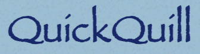

<p align="center" width="100%">
    
</p>
<h1 align="center">QuickQuill : A Note taking Application</h1>

## Overview  
A **QuickQuill** built using **Node.js**, **Express**, **MongoDB**, and **Passport.js**. The application allows users to securely log in using **Google Authentication** and create, read, update, and delete personal notes. The application emphasizes simplicity, security, and user-friendliness.

---

## Features  
- **Google Authentication**: Seamless and secure user login using Google OAuth 2.0.  
- **Personalized Notes**: Users can create, edit, and delete their only their notes.  
- **Responsive Design**: Works across various devices, including desktops, tablets, and smartphones.  
- **MongoDB Integration**: Persistent data storage for user accounts and notes.  
- **Secure Application**: Passwords and sensitive data are protected using Passport.js and environment variables.  

---

## Technologies Used  

### Backend  
- **Node.js**: JavaScript runtime for building scalable applications.  
- **Express**: Lightweight web application framework.  
- **Passport.js**: Authentication middleware for secure login using Google OAuth.  
- **MongoDB**: NoSQL database for storing user and note data.  
- **Mongoose**: Object Data Modeling (ODM) library for MongoDB.  

### Frontend  
- **EJS**, **CSS3**, **BootStrap**, **JavaScript**: Responsive and user-friendly UI.

---

## Prerequisites  
- **Node.js** (v14 or above)  
- **MongoDB** (local or cloud-based, e.g., MongoDB Atlas)  
- **Google Developer Account** (for OAuth 2.0 credentials)  

---

## Setup Instructions  

### 1. Clone the Repository  
```bash
git clone https://github.com/eebadreza/QuickQuill.git
cd QuickQuill
```
